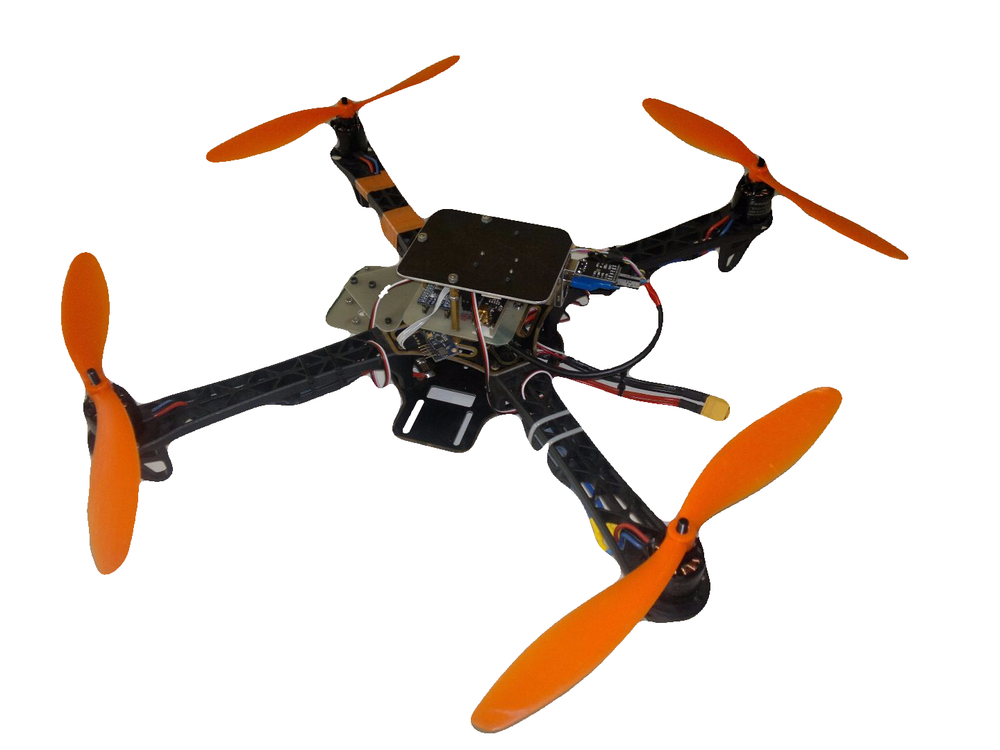
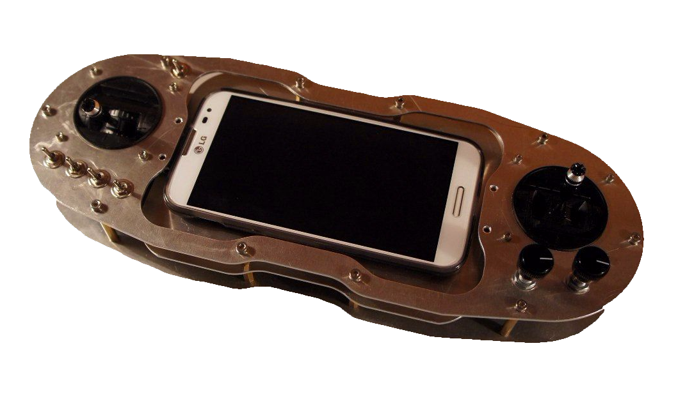
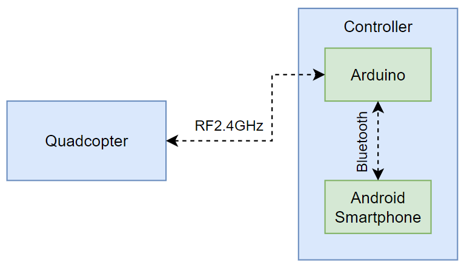
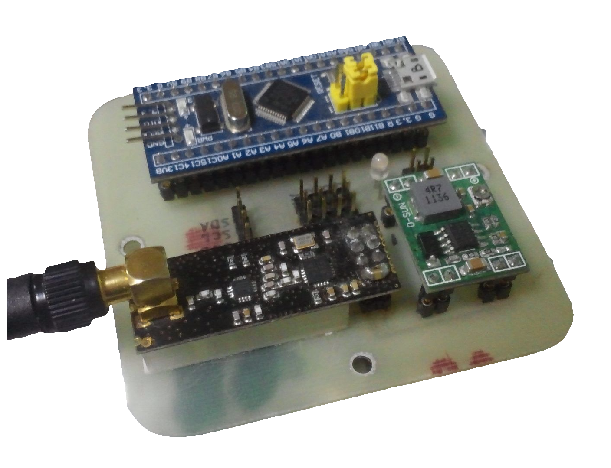
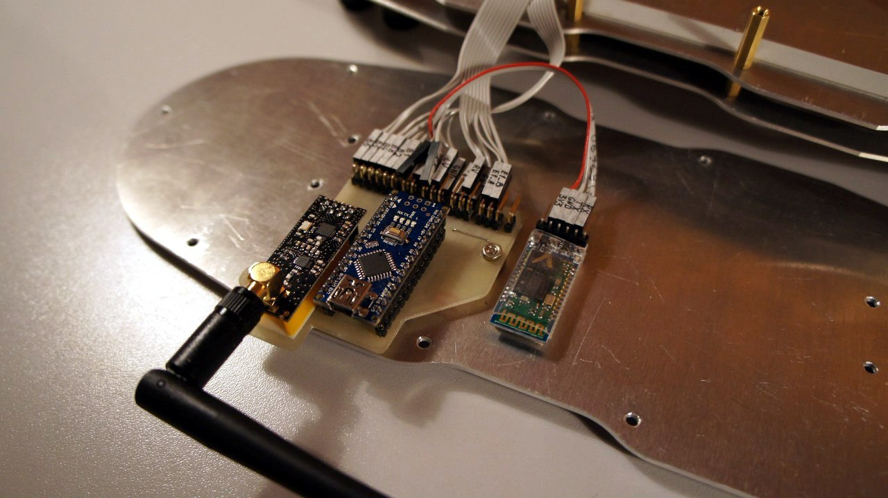
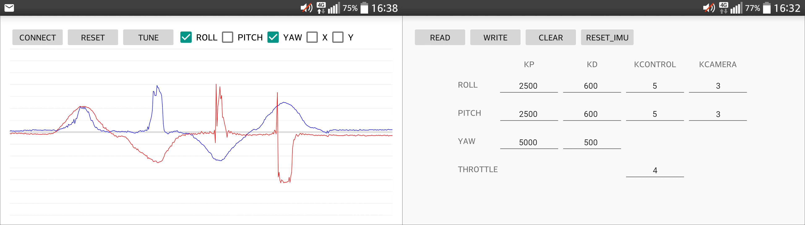

# Big Quadcopter

This project is dedicated to the development of a DIY quadcopter and its remote controller. The hardware, firmware, and software have been developed from scratch.

## Architecture

The quadcopter and the controller are both equipped with 2.4GHz radio transceivers. The controller consists of two parts:

1. An Android smartphone running an application that allows receiving and displaying telemetry data from the quadcopter, as well as adjusting quadcopter control system parameters such as PID controller coefficients
2. A custom Arduino-based board to which the smartphone is connected via Bluetooth. This board essentially serves as a data converter, transmitting information received via Bluetooth over the 2.4GHz radio, and vice versa

## Hardware

### Quadcopter

Processor: STM32F103  
IMU: GY80 (L3G4200d + ADXL345 + HMC5883 + BMP085)  
Radio: NRF24L01  
ESC: Chinese ESC with SimonK firmware  
Motors: SunnySky X2212-13 980KV
Frame: Chinese noname one

### Controller

## Firmware  

The firmware was developed from scratch in C++, except for the IMU code, which was taken from [here](https://x-io.co.uk/open-source-imu-and-ahrs-algorithms/)

## Software

The software in this project is a custom application written in Java for Android. Here are a couple of screenshots of this application:

